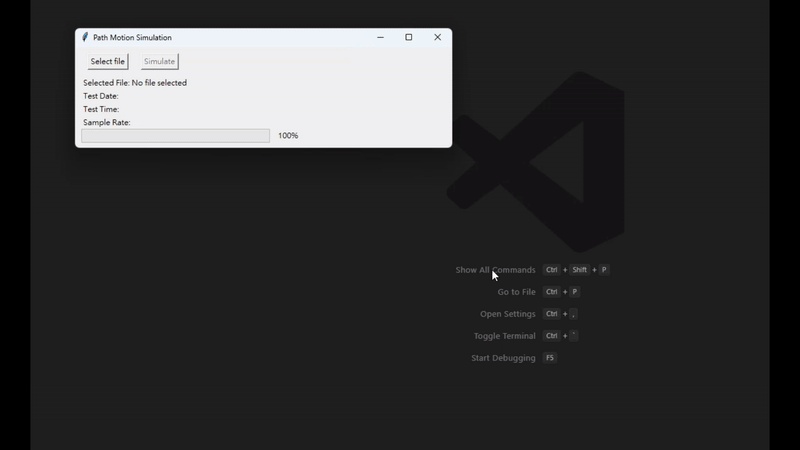

# PathMotion
Simulate path motion using accelerometer and gyroscope sensor data

## Introduction
PathMotion is a Python-based tool that processes motion data from accelerometers and gyroscopes to simulate and visualize movement paths. This project is useful for applications like motion tracking, navigation systems, and activity recognition.

## Features
- Parses motion sensor data to reconstruct movement paths.
- Uses accelerometer and gyroscope readings for precise motion simulation.
- Provides a visual representation of motion.
- Supports customizable input data.

## Usage
1. Clone the repository:
```
git clone https://github.com/your-username/PathMotion.git
cd PathMotion
```

2. Create and activate a virtual environment:
```
python -m venv venv
source venv/bin/activate  # On Windows use `venv\Scripts\activate`
```

3. Install dependencies:
```
pip install -r requirements.txt
```

4. Run the simulation:
```
python PathMotion.py
```

## Demo
